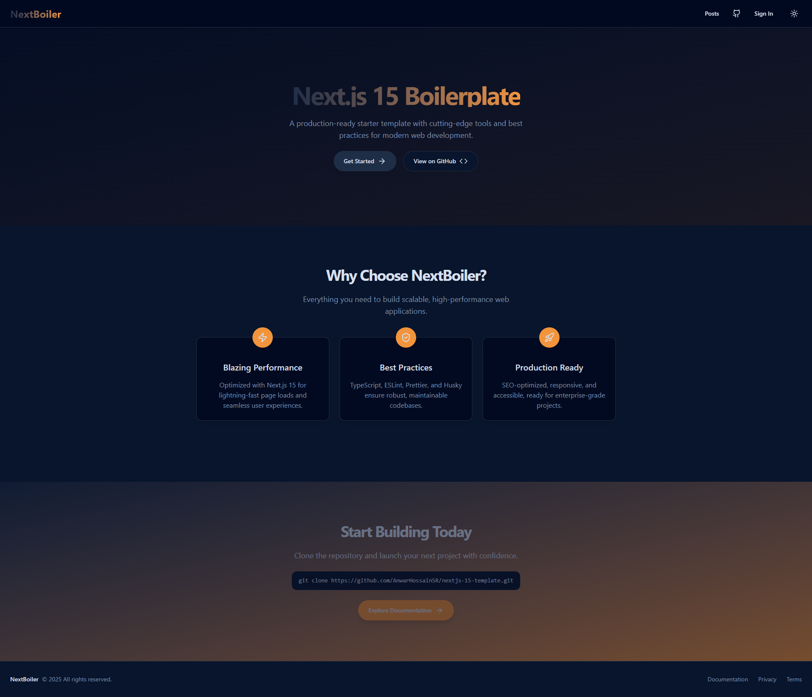

# 🚀 Md. Anwar Hossain - Portfolio Website



A modern, responsive personal portfolio website showcasing professional experience, projects, and skills. Built with cutting-edge web technologies and featuring interactive animations, dynamic backgrounds, and seamless user experience.

## ✨ Features

- **🎨 Modern Design**: Clean, professional interface with dark/light theme support
- **🌟 Interactive Background**: Dynamic particle system with mouse-responsive animations
- **📱 Fully Responsive**: Optimized for all devices and screen sizes
- **⚡ Performance Optimized**: Fast loading with lazy loading and optimized assets
- **🔍 SEO Ready**: Complete SEO optimization with meta tags, structured data, and sitemap
- **🎥 YouTube Integration**: Embedded video playlist with modal player
- **📝 Blog Section**: Dynamic blog posts with tags and categories
- **📧 Contact Form**: Interactive contact form with validation
- **🚀 PWA Support**: Progressive Web App capabilities with manifest
- **♿ Accessibility**: WCAG compliant with semantic HTML and ARIA labels

## 🛠️ Tech Stack


### Frontend

- **React 19** - Modern UI library with latest features
- **TypeScript** - Type-safe development
- **Vite** - Lightning-fast build tool
- **Tailwind CSS** - Utility-first CSS framework
- **React Router** - Client-side routing

### UI Components

- **Shadcn/UI** - Beautiful, accessible component library
- **Radix UI** - Unstyled, accessible UI primitives
- **Lucide Icons** - Beautiful & consistent icons
- **Framer Motion** - Smooth animations (via CSS animations)

### State & Data

- **TanStack Query** - Data fetching & caching
- **React Hook Form** - Form handling with validation
- **Zod** - Schema validation

### Styling & Design

- **CSS Variables** - Dynamic theming system
- **Custom Animations** - Smooth transitions and effects
- **Responsive Design** - Mobile-first approach
- **Dark/Light Mode** - System-aware theme switching

## 🚀 Quick Start

### Prerequisites

- Node.js 22+
- npm or yarn

### Installation

1. **Clone the repository**

   ```bash
   git clone git@github.com:AnwarHossainSR/personal-portfolio.git
   cd portfolio
   ```

2. **Install dependencies**

   ```bash
   npm install
   ```

3. **Start development server**

   ```bash
   npm run dev
   ```

4. **Open in browser**
   ```
   http://localhost:5173
   ```

### Build for Production

```bash
npm run build
npm run preview
```

## 📁 Project Structure

```
src/
├── components/          # Reusable UI components
│   ├── ui/             # Shadcn/UI components
│   ├── Navigation.tsx  # Main navigation
│   ├── Footer.tsx      # Site footer
│   └── SEO.tsx         # SEO component
├── pages/              # Page components
│   ├── Home.tsx        # Landing page
│   ├── About.tsx       # About section
│   ├── Experience.tsx  # Work experience
│   ├── Projects.tsx    # Portfolio projects
│   ├── Skills.tsx      # Technical skills
│   ├── Contact.tsx     # Contact form
│   ├── YouTube.tsx     # Video playlist
│   └── Blogs.tsx       # Blog posts
├── data/               # Static data
│   ├── personal.ts     # Personal information
│   ├── experience.ts   # Work experience data
│   ├── projects.ts     # Portfolio projects
│   └── skills.ts       # Technical skills
├── hooks/              # Custom React hooks
├── lib/                # Utility functions
└── assets/             # Static assets
```

## 🌟 Key Pages

- **🏠 Home**: Hero section with animated background and introduction
- **👨‍💻 About**: Personal story, background, and interests
- **💼 Experience**: Professional work history with timeline
- **🚀 Projects**: Portfolio showcase with live demos and source code
- **🛠️ Skills**: Technical expertise with proficiency levels
- **🎥 YouTube**: Video content and tutorials
- **📝 Blogs**: Technical articles and insights
- **📧 Contact**: Get in touch form with social links

## 🎨 Customization

### Theme Colors

Customize the color scheme in `src/index.css`:

```css
:root {
  --primary: 210 40% 98%;
  --secondary: 210 40% 96%;
  /* Add your custom colors */
}
```

### Personal Data

Update your information in the `src/data/` directory:

- `personal.ts` - Personal info and social links
- `experience.ts` - Work history
- `projects.ts` - Portfolio projects
- `skills.ts` - Technical skills

## 📊 Performance

- **Lighthouse Score**: 95+
- **First Contentful Paint**: < 1.5s
- **Time to Interactive**: < 2.5s
- **Bundle Size**: < 200KB (gzipped)

## 🚀 Deployment

This project is configured for deployment on **Vercel**:

1. Visit your [Vercel Dashboard](https://vercel.com/dashboard)
2. Import your GitHub repository
3. Set up build and output settings
4. Deploy your site

### Manual Deployment

#### Vercel

```bash
npm run build
npx vercel --prod
```

#### Netlify

```bash
npm run build
npx netlify deploy --prod --dir=dist
```

#### GitHub Pages

```bash
npm run build
# Deploy the `dist` folder to gh-pages branch
```

## 🔧 Development

### Available Scripts

- `npm run dev` - Start development server
- `npm run build` - Build for production
- `npm run preview` - Preview production build
- `npm run lint` - Run ESLint

### Code Quality

- **ESLint** - Code linting and formatting
- **TypeScript** - Type checking
- **Prettier** - Code formatting (configured)

## 🤝 Contributing

1. Fork the repository
2. Create a feature branch (`git checkout -b feature/amazing-feature`)
3. Commit changes (`git commit -m 'Add amazing feature'`)
4. Push to branch (`git push origin feature/amazing-feature`)
5. Open a Pull Request

## 📄 License

This project is licensed under the MIT License - see the [LICENSE](LICENSE) file for details.

## 👨‍💻 Author

**Md. Anwar Hossain**

- 🌐 Website: [Your Portfolio](https://anwarportfolio.vercel.app/)
- 💼 LinkedIn: [Your LinkedIn](https://linkedin.com/in/anwarsr)
- 🐱 GitHub: [Your GitHub](https://github.com/anwarhossainsr)
- 📧 Email: anwarmahedisr@gmail.com

---

## 🔧 Lovable Integration

### Project Information

- **Project URL**: https://anwarportfolio.vercel.app
- **Framework**: React + TypeScript + Vite
- **Deployment**: Lovable Platform

### Development Workflow

**Local Development**

1. Clone this repository
2. Run `npm install && npm run dev`
3. Push changes to sync with Lovable

**GitHub Integration**

- Connect your GitHub account via the GitHub button in Lovable
- Changes sync bidirectionally between Lovable and GitHub

### Custom Domain

To connect a custom domain:

1. Navigate to Project → Settings → Domains in Lovable
2. Click "Connect Domain"
3. Follow the setup instructions

_Note: Requires a paid Lovable plan_

---

<div align="center">

**⭐ If you found this portfolio helpful, please give it a star!**

</div>
